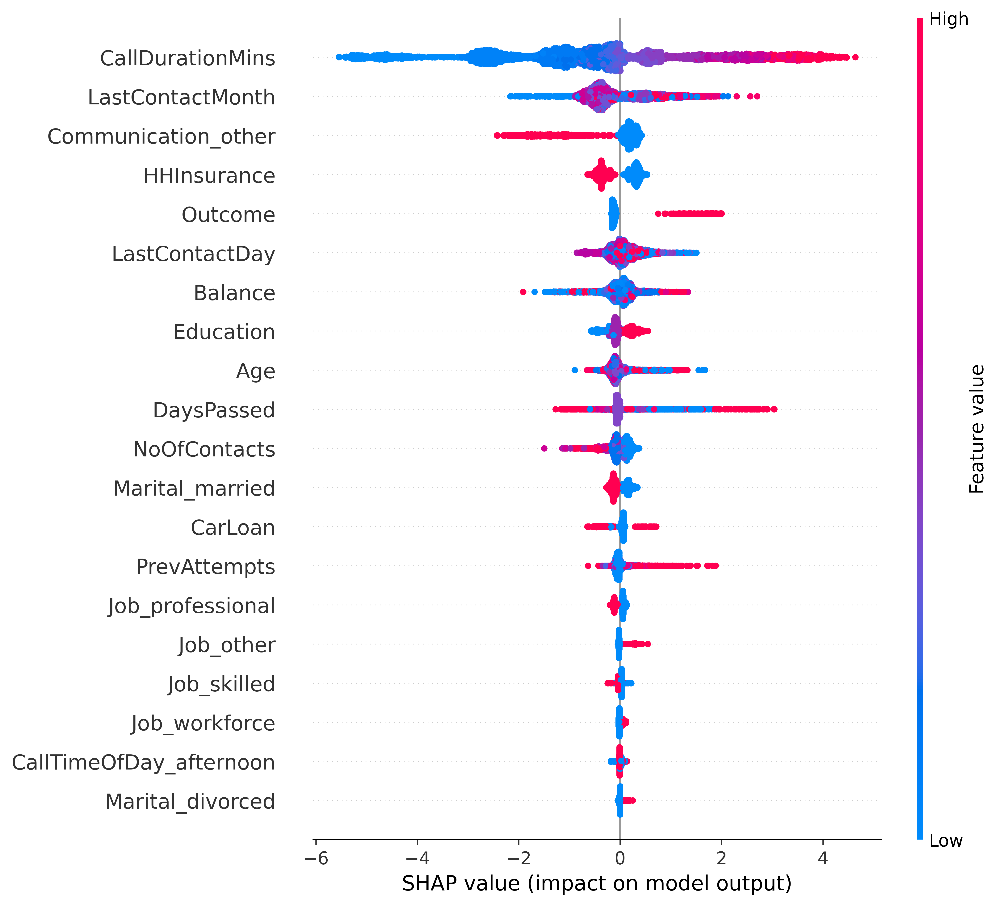
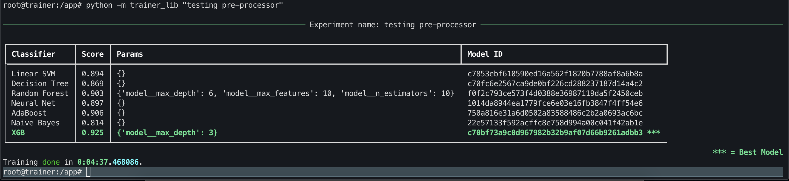
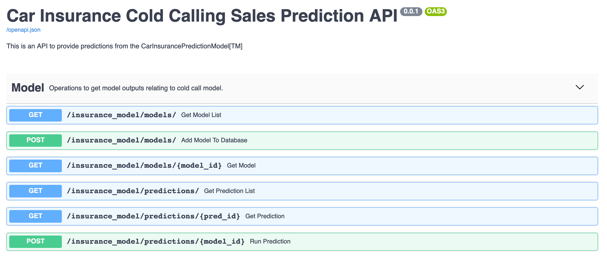

# Car Insurance Prediction Problem

The goal of this project is to develop and serve a machine learning model that will predict whether a customer will buy car insurance or not. The data was retrieved from this Kaggle competition: https://www.kaggle.com/kondla/carinsurance 

## TL;DR

I used `XGBOOST` and got an average auc of > 92% on 10 Fold cross validation using the training dat set. This was helped with feature engineering and CV grid search I believe.
The most important feature came out to be how long the previous call lasted for in minutes (see below for caveats and next steps).

**However**, having analyzed the final model I believe that the `CallDurationMins` feature needs more attention as it is not directly something we have complete control over.

**Also**, there is a strong case here for having 2 models, one for customers who were previously contacted, and one for first-time campaign customers as these would represent 2 very different subsets of the population (IMO!).

The model is served from a REST endpoint which can be used to test the model (once the containers are up and running locally).

## Project Structure

The overall project structure is the following:

```text
.
├── api                         <- Code for REST API
├── data                        <- Also holds the SQLite DB for tracking
│   ├── processed               <- Output from pre-processing steps
│   └── raw                     <- Raw data and documentation (Read only)
├── docker-compose.yml          
├── model                       <- Saved models in pickle format
├── notebooks                   <- Notebooks containing EDA and processing and model taining steps defined in the trainer_lib 
├── readme.md
├── reports                     <- Profiling outputs
└── trainer                     <- Source code for all pre-processing / model training / evaluation
    ├── trainer_lib
```

The project is broken into 2 parts:

1. Data processing and model training code in (code in `trainer/`).
2. Model serving over REST API code in (code in `api/`).

The notebooks should be viewable here on github without having to run any code but to run the code yourself, read on ..

## Running the project locally

You will need Docker installed to run this project code.
( Details available here https://docs.docker.com/get-docker/ )

To start and run the entire project locally (assuming you have docker installed):

```sh
git clone https://github.com/m-o-leary/car_insurance_prediction.git
cd car_insurance_prediction
docker-compose up
```

This will build all the required images and start the containers.
### EDA / Pre-processing and Model training via Notebooks

The easiest way to understand what my approach was to the end to end model training process is a look through the files in the `/notebooks` directory.

The interesting files are:

```text
.
├── notebooks 
    ├── mol-exploration.ipynb       <- Notebook containing analysis and some conclusions about the data processing required  
    ├── mol-data-processing.ipynb   <- Data processing pipeline generation 
    ├── mol-model.ipynb             <- The model training and evaluation code

```

To access this go to http://127.0.0.1:8899/lab?token=justatokengesture in a browser once the `car_insurance_prediction_trainer_1` container is  up and running.

**The port is set in the `docker-compose.yml` file so if you need to change it from `8899`, change it there and restart the container**

### Training from the command line

Once your project is up and running, you can train the model pipeline with the following commands:


```bash
docker exec -it car_insurance_prediction_trainer_1 bash
python -m trainer_lib "experiment name"
```

If all goes accoring to plan, you should see thet `trainer_lib` run and output the following to the terminal:



Help for the command:

```text
root@trainer:/app# python -m trainer_lib -h
usage: trainer_lib [-h] [--profile] [--out OUT] [--model [{Linear SVM,Decision Tree,Random Forest,Neural Net,AdaBoost,Naive Bayes,XGB} ...]] experiment

positional arguments:
  experiment            Name of the experiment

optional arguments:
  -h, --help            show this help message and exit
  --profile             Profile the data and save to /app/reports/ directory.
  --out OUT             If provided, will store the transformed data in this location.
  --model [{Linear SVM,Decision Tree,Random Forest,Neural Net,AdaBoost,Naive Bayes,XGB} ...]
                        Specify a list of models to train. By default will train the following list: Linear SVM, Decision Tree, Random Forest, Neural Net, AdaBoost, Naive
                        Bayes, XGB.
```

### Model Serving

The model is exposed as a RESTful API (via FastAPI) and that code is running in the `car_insurance_prediction_api_1` container.

The API comes with a swagger UI for testing and documenting the API (as well as the `openapi.json` file which can be used to quickly bootstrap a client )



To access this go to http://127.0.0.1:3007/docs# in a decent web browser.
The following link will provide a better (to my eye) explanation of the API schemas http://127.0.0.1:3007/redoc/ 

**The port is set in the `docker-compose.yml` file so if you need to change it from `3007`, change it there and restart the container**
